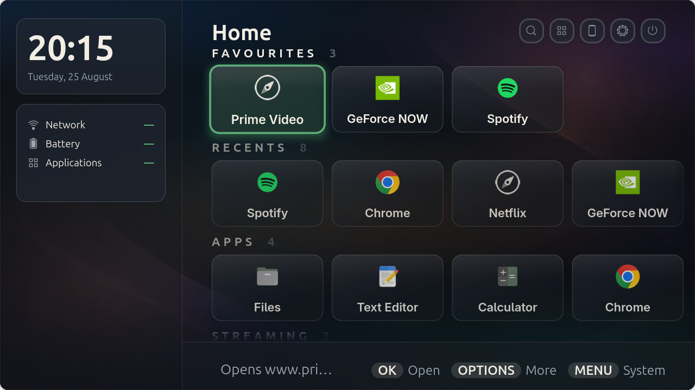
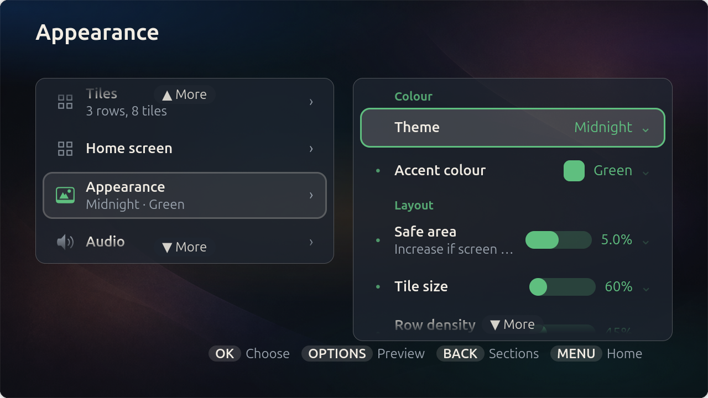
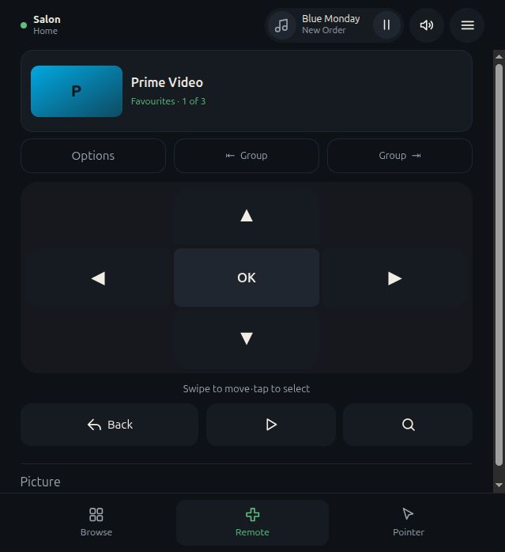

# Salon

**A fullscreen GNOME launcher built for the sofa.**

Salon opens your applications, games and websites as large television-friendly
tiles. Control it with a gamepad, keyboard, mouse, HDMI-CEC remote or phone.



- Launch installed apps, web apps and commands
- Search and configure everything without leaving the television
- Run as an app or as a dedicated GNOME Kiosk session

<p align="center">
  
  
</p>

## Install

### Flatpak — recommended

Requires Flatpak 1.16 or newer. See [flatpak.org/setup] if Flatpak is not yet
installed.

```sh
flatpak install --user https://alexydaher.github.io/salon/io.github.alexydaher.Salon.flatpakref
```

Open **Salon** from the applications screen, or run:

```sh
flatpak run io.github.alexydaher.Salon
```

### Debian and Ubuntu — Kiosk-ready

Add Salon's signed APT archive once. Salon then installs and updates like any
other package, including through Software Updater.

```sh
sudo install -d -m 0755 /etc/apt/keyrings
curl -fsSL https://alexydaher.github.io/salon/apt/salon-archive-keyring.gpg \
  | sudo tee /etc/apt/keyrings/salon-archive-keyring.gpg >/dev/null
sudo tee /etc/apt/sources.list.d/salon.sources >/dev/null <<'EOF'
Types: deb
URIs: https://alexydaher.github.io/salon/apt
Suites: stable
Components: main
Signed-By: /etc/apt/keyrings/salon-archive-keyring.gpg
EOF
sudo apt update
sudo apt install salon
```

The same package works on AMD64 and ARM64. The archive carries the current
release only, which is what upgrades need; older versions stay on the
[latest release] page.

<details>
<summary>Offline bundle, single package or source install</summary>

To install the package without adding the archive, download the `.deb` from
the [latest release] and install that file. Updates are then manual.

```sh
cd ~/Downloads
sudo apt install ./salon_*-1_all.deb
```

For an offline installation, download the Flatpak bundle for your architecture
from the [latest release], then run:

```sh
cd ~/Downloads
flatpak install --user ./Salon-*.flatpak
```

To run Salon from source:

```sh
git clone https://github.com/alexydaher/salon.git
cd salon
meson setup build
./bin/salon
```

Minimums: Python 3.12, GTK 4.16.0, libadwaita 1.5.0, GLib 2.80.0,
GdkPixbuf 2.42.0, libsoup 3.0.0 and libmanette 0.2.0. The source of truth is
[minimum-versions.ini](build-aux/minimum-versions.ini).

See the [development guide](docs/development.md) for the source workflow and
the [session guide] for a system-wide source install.

</details>

## Kiosk

**Salon (Kiosk)** replaces the normal desktop for that login session. There is
no panel, dock or overview, and launched applications are fullscreen.

1. Install the Debian package above, or [install from source system-wide][session guide].
2. Install the compositor: `sudo apt install gnome-kiosk`
3. Log out, open the login-screen gear menu and choose **Salon (Kiosk)**.

This does not replace your normal desktop; the choice applies only to that
login. Flatpak cannot add login-screen sessions. See the [session guide] for
source installation and troubleshooting.

## Update

| Installation | How to update |
|---|---|
| Flatpak | `flatpak update io.github.alexydaher.Salon` |
| Debian or Ubuntu | `sudo apt update && sudo apt upgrade`, or Software Updater |
| Single package or offline bundle | Download the new file from the [latest release] and install it again |
| Source | `git pull` — the next `./bin/salon` launch rebuilds it |

## Uninstall

| Installation | Command |
|---|---|
| Flatpak | `flatpak uninstall --user io.github.alexydaher.Salon` |
| Debian or Ubuntu | `sudo apt remove salon` |
| Source | `sudo ninja -C build uninstall` |

After uninstalling the Flatpak, `flatpak remote-delete --user salon` also
removes its update source; the APT equivalent is deleting
`/etc/apt/sources.list.d/salon.sources` and
`/etc/apt/keyrings/salon-archive-keyring.gpg`. Tiles and settings are kept by
default.

<details>
<summary>Also delete all tiles and settings</summary>

This cannot be undone.

```sh
rm -rf ~/.config/salon ~/.local/share/salon ~/.cache/salon
rm -rf ~/.var/app/io.github.alexydaher.Salon
dconf reset -f /io/github/alexydaher/Salon/
```

</details>

## Licence

GPL-3.0-or-later. See [LICENSE](LICENSE).

[flatpak.org/setup]: https://flatpak.org/setup/
[latest release]: https://github.com/alexydaher/salon/releases/latest
[session guide]: docs/sessions.md
