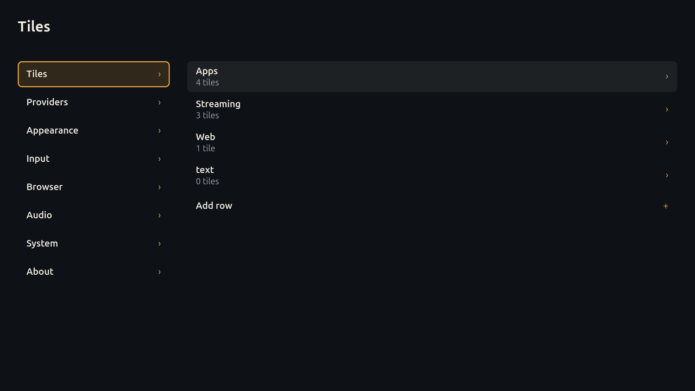

# Salon

A fullscreen launcher for GNOME, built for a television across a room and a
controller in your hand.

Salon does one job: it shows you the things you want to watch and play, and
it starts them. It is not a media player, not a media server, and not a
skin over one. It launches the applications and web apps you already have.


## What it does

* **Rows of tiles**, laid out and sized for three metres away rather than
  sixty centimetres. Focus is a scale-up, an accent ring and a soft bloom
  cast onto the neighbouring tiles, so where you are is never in question.
* **A controller is the whole interface.** A direction pad, OK and Back run
  everything, including the settings and the tile editor; UP from the first
  row reaches search, all your apps, settings and power. A mouse and a
  phone-as-trackpad are first-class alternatives, not afterthoughts —
  every tile is clickable and hover moves the selection.
* **A way back out.** When something you started is filling the screen,
  START closes it and returns you to Salon. Salon hears the controller even
  when it can't see the screen, which is the only reason this can work at
  all on Wayland — see [DECISIONS.md](DECISIONS.md).
* **Favourites and an all-apps grid.** X over any tile pins it to a row at
  the top; the grid button lists every application on the machine, A–Z.
* **Search across everything**: your tiles and every application installed
  on the machine, at once. Type on the on-screen keyboard, or open the
  address it shows on your phone and type there instead.
* **Launch anything**: desktop entries, Flatpaks, plain commands, and web
  apps opened fullscreen in a browser with their own profile so one
  sign-in can't disturb another's.
* **Edit from the sofa.** Add tiles, group them into rows, set artwork,
  pick accent colours, reorder and delete — all with the controller. The
  catalogue is a plain JSON file you can also edit by hand; it hot-reloads
  either way.
* **See what you're changing.** Accent colour, tile size, row density and
  the safe-area inset are adjusted from a strip along the bottom edge with
  the live home screen behind it, rather than from a list of their names.
* **Providers.** Rows can come from your own Python file dropped in a
  folder. A provider that hangs, crashes, or returns nonsense is isolated
  and reported rather than taking the launcher with it. See
  [docs/providers.md](docs/providers.md).




## About DRM, honestly

**Salon cannot play Netflix, Prime Video, or Disney+ itself, and neither
can any other application on Linux that isn't a browser.** Those services
require Widevine at a security level that is only licensed to browsers and
to certified hardware. There is no library to link against and no API to
call; this is a licensing wall, not a missing feature.

What Salon does instead is honest about it: a tile for one of those
services opens the site in Chrome or Chromium, fullscreen, in its own
browser profile, with the page scaled up so it is readable from a sofa.
That is the same thing you would do by hand, minus the hunting for a
window. Playback quality is whatever the browser is licensed for, which on
Linux is usually 720p — again, not something an application can change.

Anything that isn't DRM-locked — YouTube, your own media, Steam, GeForce
NOW, emulators, any installed app — runs natively and is unaffected.

## Buttons

| | Controller | Keyboard | TV remote (CEC) |
|---|---|---|---|
| Move | D-pad / left stick | Arrows | D-pad |
| Choose | A | Return | OK |
| Back | B | Backspace | Back |
| Search | Y | `/` | — |
| Options for the selected tile | X | F10 or `o` | Contents menu / blue |
| Settings and power | START | Menu | Setup menu |

START is the one button that always means the same thing. On the home
screen it opens the system menu; inside Settings it returns you home; while
a launched app has the screen it closes that app and brings you back.

## Requirements

* GNOME on Wayland. Salon is Wayland-only by design and does not fall back
  to X11.
* GTK 4.16 or newer (for CSS `var()`), libadwaita 1.5+, PyGObject.
* Optional: `libmanette` for gamepads, `wpctl` (PipeWire) for volume,
  `cec-client` for HDMI-CEC, Chrome or Chromium for web tiles.

## Building and running

```sh
meson setup build
meson compile -C build
./bin/salon              # runs uninstalled, out of ./build
```

To install so it shows up in **Show Applications** alongside everything
else — no root needed:

```sh
meson configure build --prefix="$HOME/.local"
meson install -C build
```

That puts `salon` on your `PATH`, the desktop entry in
`~/.local/share/applications`, and the icon in the user icon theme. Re-run
`meson install -C build` after changing anything; the installed copy is a
snapshot, not a link to the source tree. For a system-wide install use
`--prefix=/usr/local` and `sudo meson install -C build` instead.

There is a Flatpak manifest (`rocks.salon.Salon.yaml`). Read the comment at
the top of it first: a launcher's entire purpose is starting other
applications, so the manifest asks for host-spawn access, which is not
meaningfully a sandbox. A distribution package or a Meson install is the
more honest option.

## Running it as the session

Installing puts a session entry in `wayland-sessions`, so **Salon** can be
chosen at the login screen. That starts GNOME Shell with Salon as a
required component — if Salon exits, the session restarts it, which is what
makes the machine behave like a television rather than a desktop with a
launcher on it.

For a gentler version, Settings → System → **Start Salon at login** just
adds an autostart entry to your normal desktop session.

## Configuration

Tiles live in `~/.config/salon/tiles.json`. Everything else is GSettings
under `rocks.salon.Salon`. Both are editable by hand, and both are editable
from the interface; changes made either way take effect immediately.

Artwork can be an explicit path, an `https://` URL that Salon fetches and
caches, or a file dropped into `~/.local/share/salon/artwork/` named after
the tile's id. If there is none, Salon composites the application's own
icon onto a gradient built from that icon's dominant colour.


## Development

```sh
./scripts/check.sh     # ruff, mypy --strict, pytest, meson compile
```

`CLAUDE.md` is the orientation document for the codebase; `DECISIONS.md`
records the reasoning behind judgement calls that aren't obvious from the
code.

Two rules matter more than the rest:

* `salon/core/` must never import `gi`. It is enforced by a test that walks
  the AST, and it is what keeps the model, the focus machine, the launch
  resolution and the provider runner testable without a display.
* Don't unit-test GTK widgets. Test the pure layers; verify the widgets by
  running the app and looking at it.

## Logs

Salon is a required component of its own gnome-session, so a crash is
followed by a restart and, without somewhere to write, no evidence. It logs
to stderr — which the session manager hands to the journal — and to
`$XDG_STATE_HOME/salon/salon.log` (rotated, 512 KiB × 3). `SALON_DEBUG=1`
turns on debug output, including GTK's own.

## Licence

GPL-3.0-or-later. See [LICENSE](LICENSE); every source file carries an SPDX
identifier.
