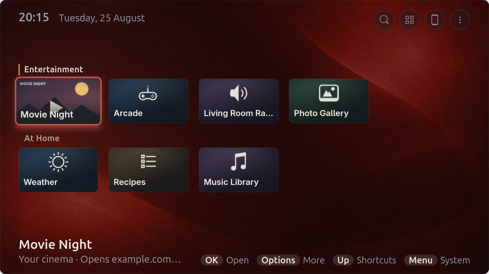
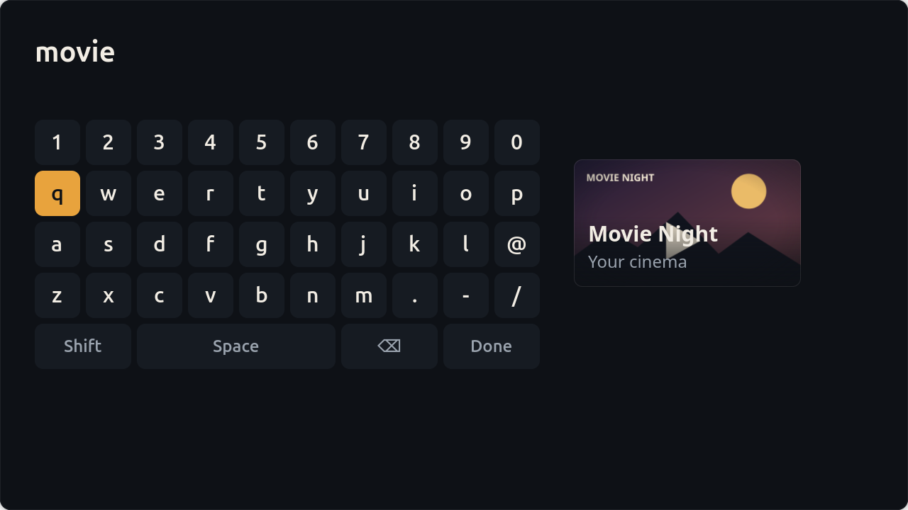
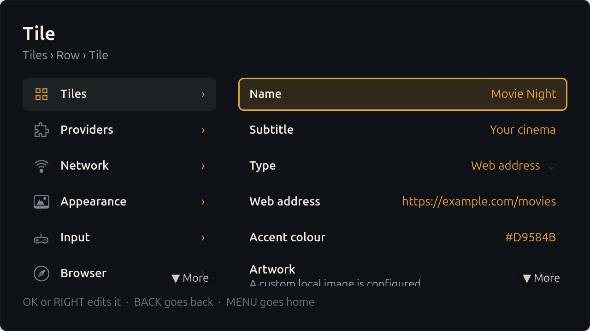

# Salon

A fullscreen launcher for GNOME, built for a television across a room and a
controller in your hand.

Salon does one job: it shows you the things you want to watch and play, and
it starts them. Rows of large tiles sized to be read from three metres, driven
entirely by a D-pad, OK and Back — or by a mouse, a TV remote over HDMI-CEC,
or your phone. It is not a media player and not a media server; it launches
the applications and web apps you already have.



## Install

**Flatpak — easiest, and updates itself.** Needs Flatpak 1.16+; see
[flatpak.org/setup](https://flatpak.org/setup/) if `flatpak --version` fails.

```sh
flatpak install --user https://alexydaher.github.io/salon/io.github.alexydaher.Salon.flatpakref
```

That adds the signed `salon` remote, so later releases arrive with a normal
`flatpak update`. Then launch **Salon** from your applications screen, or
`flatpak run io.github.alexydaher.Salon`.

**Debian package — adds the login-screen sessions.** Download
`salon_0.2.11-1_all.deb` from the [latest release][latest-release] and let APT
resolve the dependencies:

```sh
sudo apt install ~/Downloads/salon_0.2.11-1_all.deb
```

It is `Architecture: all` and works on both AMD64 and ARM64. Unlike the
Flatpak remote, it does not update itself.

**Offline Flatpak bundle.** `Salon-v0.2.11-x86_64.flatpak` or
`-aarch64.flatpak` from the [latest release][latest-release] — run `uname -m`
if you are unsure which. `flatpak install --user ~/Downloads/<file>`. Each
release also ships `SHA256SUMS` if you want to check the download.

**From source.**

```sh
git clone https://github.com/alexydaher/salon.git && cd salon
meson setup build
./bin/salon                              # runs uninstalled, out of ./build
```

`meson install -C build` installs it; configure the prefix first. A user
prefix (`--prefix="$HOME/.local"`) needs no root but cannot reach the login
screen — GDM's search paths are compiled in and absolute, so the session
entries have to land under `/usr/share`. Use `--prefix=/usr` and
`sudo meson install` for a television or kiosk machine. `./scripts/check.sh`
runs every gate.

| Installation | Best for | Login session | Auto-updates |
|---|---|:---:|:---:|
| Flatpak remote | Most people | No | Yes |
| Debian package | A television or kiosk machine | Yes | No |
| Flatpak bundle | Offline or one-off | No | No |
| Source, `--prefix=/usr` | Development, or a custom appliance | Yes | No |

To remove it:

```sh
flatpak uninstall --user io.github.alexydaher.Salon
flatpak remote-delete --user salon
```

[latest-release]: https://github.com/alexydaher/salon/releases/latest

## What it does

* **Rows of tiles** sized for three metres, not sixty centimetres. Focus is a
  scale-up, an accent ring and a soft bloom on the neighbours, so where you
  are is never in question.
* **A controller is the whole interface** — settings and the tile editor
  included. UP from the first row reaches search, all your apps, settings and
  power. A mouse and a phone-as-trackpad are first-class, not afterthoughts.
* **A way back out.** When something you launched fills the screen, START
  closes it and returns you to Salon.
* **Search across everything** — your tiles and every installed application at
  once, from the on-screen keyboard or from your phone.
* **Your phone is the remote.** MENU → Connect a phone puts a QR code on the
  television. Scanning it — nothing to type — opens a page with your rows and
  their artwork, a D-pad, a trackpad, volume, a keyboard, and controls for
  whatever is playing. With nothing connected at all, the pairing code is
  already waiting in the corner of the home screen.
* **Launch anything**: desktop entries, Flatpaks, plain commands, and web apps
  opened fullscreen in a browser with their own profile.
* **Edit from the sofa.** Add tiles, group them into rows, set artwork and
  accent colours, reorder and delete — all with the controller. The catalogue
  is a plain JSON file you can also edit by hand; it hot-reloads either way.
* **Providers.** Rows can come from your own Python file dropped into
  `$XDG_DATA_HOME/salon/providers/`, exposing a `provider()` function. One
  that hangs, crashes or returns nonsense is isolated and reported in
  Settings → Providers rather than taking the launcher with it.



## Buttons

| | Controller | Keyboard | TV remote (CEC) |
|---|---|---|---|
| Move | D-pad / left stick | Arrows | D-pad |
| Choose | A | Return | OK |
| Back | B | Backspace | Back |
| Search | Y | `/` | — |
| Options for the selected tile | X | F10 or `o` | Contents menu / blue |
| Previous / next group | LB / RB | Page Up / Page Down | Channel down / up |
| Settings and power | START | Menu | Setup menu |

START always means the same thing. On the home screen it opens the system
menu; inside Settings it returns you home; while a launched app has the screen
it closes that app and brings you back.

Inside Settings, RIGHT opens the highlighted section or control and B is the
only button that goes back.

## Requirements

GNOME on Wayland. Salon is Wayland-only by design and does not fall back to
X11. Python 3.12+, GTK 4.16.0+, libadwaita 1.5.0+, GLib 2.80.0+, GdkPixbuf
2.42.0+, libsoup 3.0.0+, PyGObject and libmanette 0.2.0+ — the authoritative
values live in `build-aux/minimum-versions.ini`, which Meson reads directly.

Optional: `wpctl` (PipeWire) for volume, `cec-client` for HDMI-CEC, Chrome or
Chromium for web tiles, `gnome-kiosk` for the kiosk session, Orca for screen
reader use. Missing ones are reported in Settings rather than assumed.

The Flatpak also runs on KDE Plasma Wayland, without the GNOME-specific
session integration.

## Configuration

Tiles live in `~/.config/salon/tiles.json`, or
`~/.var/app/io.github.alexydaher.Salon/config/salon/tiles.json` for the
Flatpak. Everything else is GSettings under `io.github.alexydaher.Salon`. Both
are editable by hand and from the interface, and changes take effect
immediately.

Artwork can be an explicit path, an `https://` URL that Salon fetches and
caches, or a file named after the tile's id dropped into
`~/.local/share/salon/artwork/` (`~/.var/app/…/data/salon/artwork/` for the
Flatpak). With no artwork, Salon composites the application's own icon onto a
gradient built from that icon's dominant colour.



## Honest limits

**Salon cannot play Netflix, Prime Video or Disney+ itself** — and neither can
any Linux application that isn't a browser. Those services require Widevine at
a security level licensed only to browsers and certified hardware. There is no
library to link and no API to call; it is a licensing wall, not a missing
feature. So a tile for one of them opens the site in Chrome or Chromium,
fullscreen, in its own profile, scaled up to be readable from a sofa — the
same thing you would do by hand, minus the hunting. Anything not DRM-locked
(YouTube, your own media, Steam, GeForce NOW, emulators, any installed app)
runs natively and is unaffected.

**The phone remote is not encrypted.** It is plain HTTP on your local network.
Two things guard it: a 128-bit session token carried in the QR code's URL
*fragment*, so it never reaches a server log, and a four-digit code for anyone
typing the address by hand, with a lockout after five wrong guesses. Both stop
a stranger *sending* something to your television. Neither stops someone
already on your Wi-Fi from *reading* what you type. It's a search box and a
remote, so this is usually nothing — but don't type a password into it.
Requests from outside your own network are refused outright, the server runs
only while something is asking for it, and it shuts down after five idle
minutes. TLS would mean a self-signed certificate, which means a browser
warning, which would cost the one-scan pairing for a threat model that is
"someone is already on your Wi-Fi".

**The Flatpak cannot install a login-screen session.** Flatpak exports only
`applications`, `icons`, `metainfo` and a couple of others out of the sandbox;
`wayland-sessions` and `gnome-session/sessions` are not among them. It also
cannot ask the compositor for input injection without a consent dialog, so it
uses the desktop portal, which prompts once. Everything else works in both
builds. Use the Debian package or a `--prefix=/usr` source install to get
**Salon** and **Salon (Kiosk)** at the login screen — the kiosk entry swaps
GNOME Shell for [GNOME Kiosk][kiosk], which fullscreens every window it is
handed and so is the only way native applications go fullscreen.

[kiosk]: https://gitlab.gnome.org/GNOME/gnome-kiosk

**Only web tiles can be made fullscreen.** URL tiles pass
`--start-fullscreen`; native applications decide their own window state, and
no Wayland client may override another's. The kiosk session is the way around
this — a *compositor* may, and GNOME Kiosk does it by default.

**English only.** No gettext and no `po/`. A decision for 0.x rather than an
oversight, but it is a decision.

## What hasn't been tested

Salon is 0.2. The gates are green — ruff, `mypy --strict`, 572 tests, and the
AppStream and desktop-entry validators on every push — but green tests are not
a verified appliance, and some of this needs hardware.

* **HDMI-CEC has never touched an adapter.** The keycode table and the
  `cec-client` line parsing are covered by tests; nothing else has run against
  a television.
* **One controller, partially.** A DualSense over USB enumerates and delivers
  events. Other pads are untested — if yours is wrong, that's a bug worth
  filing; the mapping is in `salon/input/gamepad.py`.
* **A polkit refusal has never been seen.** Suspend, restart and shut down
  work. The path where logind says *no* and the denial has to arrive as a
  message on screen is unreachable from an account permitted to do them.
* **No screen reader.** Roles, names and selected/active-descendant
  relationships are published and were checked by walking the live AT-SPI
  tree, but Orca has never been run against Salon.
* **Read at a desk, not across a room.** Whether the tile size and the row
  anchor work at three metres, and whether the focus bloom is right on a
  panel with a television's black level, are still guesses.

On an iPhone, Share → **Add to Home Screen** gives the remote its own icon and
opens it fullscreen. Android's Chrome will not offer to install it: that needs
a service worker, which needs a secure context, which needs HTTPS — the same
wall as above. Chrome's ⋮ → Add to Home screen still makes a shortcut.

## Licence

GPL-3.0-or-later. See [LICENSE](LICENSE); every source file carries an SPDX
identifier.
